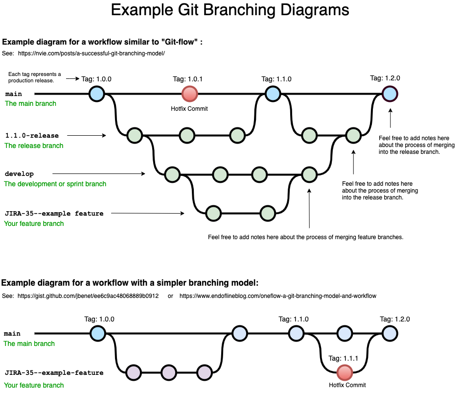

# Git
## Commit
- Only combine changes from the same topic in a single commit
- Use `git add -p <file>` to select hunks interactively and stage specific changes (can be within the same file).
- Perfect Commit Message:
    1. Subject = concise summary of what happened
    2. Body = more detailed explanation
        - what is now different than before?
        - what is the reason for this change?
        - is there anything to watch out for / anything particularly remarkable?

## Branching Strategy
- A written best practice of how work is ideally structured in your team is needed to avoid mistakes and collisions.
- It highly depends on team / team size, the project and how releases are handled.
- It helps to onboard new team members.

Main categories of branching strategies:
1. Mainline Development ("Always Be Integrating")
    - few branches
    - relatively small commits
    - high-quality testing and QA standards
2. State, Release, and Feature Branches
    - different types of branches
    - fulfills different types of jobs and workflows

Types of Branches:
1. Long-Running
    - exists through the complete lifetime of the project
    - often, they mirror 'stages' in your development life cycle
    - common convention: no direct commits
2. Short-Lived
    - for new features, bug fixes, refactorings, experiments, ...
    - will be deleted after integration (merge/rebase)

